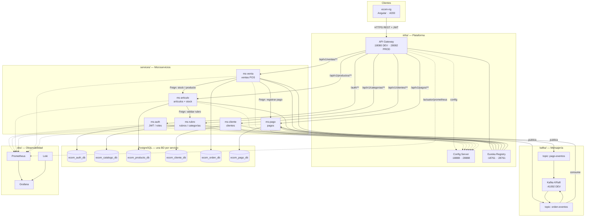

# Plantilla de Informe - Proyecto Final de Microservicios

```
Universidad:
Curso:
Docente:
Equipo:
Proyecto:
Fecha:
```

---

## 1. Descripcion del Proyecto

Describa en 3 a 5 parrafos el dominio del problema y la solucion propuesta.

- Que problema resuelve?
- Cual es el flujo principal del negocio?
- Quienes son los actores o usuarios del sistema?

---

## 2. Arquitectura

### 2.1 Diagrama de Arquitectura

**NovaMarket (minimarket POS)** expone una API unificada a través del **Spring Cloud Gateway**. El frontend **ecom-ng** (Angular) consume rutas REST bajo el gateway (puerto `18080` en DEV). Los microservicios se registran en **Eureka**, obtienen configuración desde **Config Server** (`infra/config-repo`) y persisten en **PostgreSQL** (una base por servicio). El flujo de caja es **síncrono** (OpenFeign: venta → artículo y pago) y además publica **eventos Kafka** (`orden-eventos`, `pago-eventos`) para desacoplar notificaciones. La pila **obs/** recolecta métricas (Prometheus) y logs (Loki/Promtail) visualizados en Grafana.



**Leyenda rápida**

| Relación | Descripción |
|----------|-------------|
| `Cliente → Gateway` | Punto único de entrada; validación JWT (excepto `/auth/**` y rutas de prueba documentadas). |
| `Gateway → ms-*` | Enrutamiento `lb://` vía Eureka (`infra/config-repo/gateway-*.yml`). |
| `ms-venta → ms-articulo / ms-pago` | Flujo de caja síncrono al confirmar venta (stock y cobro). |
| `ms-articulo → ms-rubro` | Consulta de categoría/rubro del artículo. |
| `ms-venta ↔ Kafka ↔ ms-pago` | Eventos asíncronos post-venta (`orden-eventos` → consumidor en ms-pago; `pago-eventos` al registrar). |
| `obs/` | Scraping de métricas y agregación de logs para dashboards en Grafana. |

### 2.2 Tecnologias

| Componente | Tecnologia | Version |
|---|---|---|
| Lenguaje / Runtime | Java / Spring Boot | |
| Gateway | Spring Cloud Gateway | |
| Config Server | Spring Cloud Config | |
| Registry | Eureka | |
| Base de datos | | |
| Mensajeria | | |
| Frontend | | |
| Contenedores | Docker | |
| Observabilidad | Prometheus / Loki / Grafana | |

### 2.3 Puertos y Naming

| Servicio | Nombre interno | Puerto interno | Puerto host (prod) |
|---|---|---|---|
| Config Server | | | |
| Eureka | | | |
| Gateway | | | |
| | | | |
| | | | |
| | | | |

---

## 3. Microservicios

### 3.1 Lista de servicios

| Servicio | Responsabilidad | Base de datos | Dependencias |
|---|---|---|---|
| | | | |
| | | | |
| | | | |

### 3.2 Interfaces entre servicios

Complete para cada interaccion entre microservicios:

| Origen | Destino | Tipo (Feign / RestTemplate / Kafka) | Endpoint | Resiliencia |
|---|---|---|---|---|
| | | | | |
| | | | | |

---

## 4. Seguridad

Describa el modelo de seguridad implementado:

- Donde se valida el token?
- Como se protegen las rutas?
- Que microservicios validan token directamente y cuales no?
- Como se manejan los roles (si aplica)?

---

## 5. Despliegue

### 5.1 Estructura del repositorio

```
proyecto/
├── infra/
│   ├── compose.yml
│   ├── config/
│   ├── eureka/
│   └── gateway/
├── services/
│   ├── servicio-a/
│   ├── servicio-b/
│   └── ...
├── clients/
│   └── frontend/
├── kafka/
├── obs/
└── docs/
```

### 5.2 Instrucciones de ejecucion

```powershell
# Requisitos
# - Docker
# - Java 21
# - ...

# Paso 1: Levantar infraestructura
docker compose -f infra/compose.yml up -d

# Paso 2: ...
```

### 5.3 Variables de entorno

| Variable | Descripcion | Ejemplo |
|---|---|---|
| `DB_HOST` | Host de base de datos | |
| `DB_PORT` | Puerto de base de datos | |
| `DB_NAME` | Nombre de base de datos | |
| `DB_USER` | Usuario de base de datos | |
| `DB_PASS` | Contrasena de base de datos | |
| `CONFIG_SERVER_URL` | URL del config server | |
| `JWT_SECRET` | Secreto para firmar JWT | |

---

## 6. Observabilidad

### 6.1 Metricas

Describa que metricas expone cada servicio y como se visualizan en Prometheus / Grafana.

### 6.2 Logs

Describa como se centralizan los logs en Loki.

### 6.3 Alertas

| Alerta | Condicion | Que detecta |
|---|---|---|
| | | |
| | | |

### 6.4 Matriz de observabilidad

| Microservicio | `UP` en Prometheus | Requests visibles | Errores visibles | Logs en Loki | Alerta definida |
|---|---|---|---|---|---|
| | si/no | si/no | si/no | si/no | si/no |
| | si/no | si/no | si/no | si/no | si/no |
| | si/no | si/no | si/no | si/no | si/no |

---

## 7. Kafka (si aplica)

### 7.1 Topicos

| Topico | Productor | Consumidor | Formato del evento |
|---|---|---|---|
| | | | |
| | | | |

### 7.2 Flujo de eventos

Describa el flujo de principio a fin.

---

## 8. Pruebas

| Tipo | Herramienta | Cobertura |
|---|---|---|
| Unitarias | | |
| Integracion | | |
| API / Contract | | |
| Carga / Estres | | |

---

## 9. Lecciones Aprendidas

Cada integrante debe escribir 2 a 3 lecciones aprendidas durante el proyecto.

**Integrante 1:**
- 
- 
- 

**Integrante 2:**
- 
- 
- 

---

## 10. Conclusiones

Resumen de los logros del proyecto, dificultades encontradas y posibles mejoras futuras.

---

## 11. Referencias

- Documentacion oficial de Spring Boot, Spring Cloud, etc.
- Repositorios base del curso
- Tutoriales o guias consultadas
